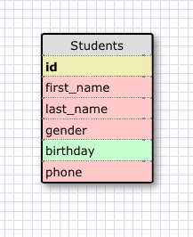
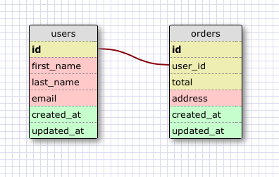
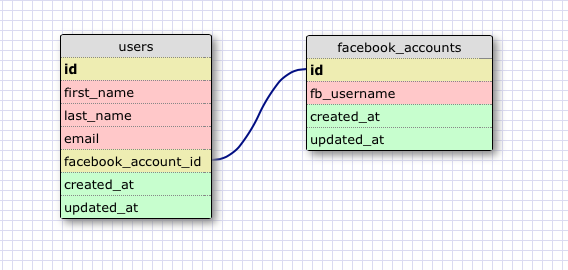
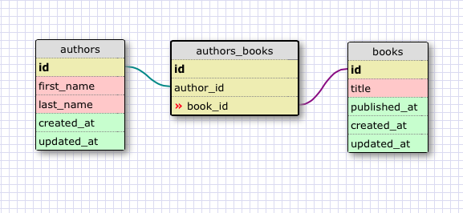
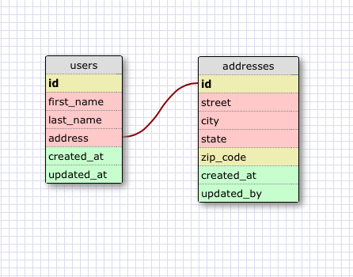
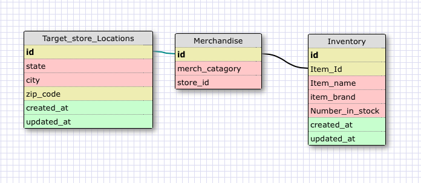

# U3.W7: Designing Schemas

#### I worked on this challenge [by myself, with: ]

## Release 0: Student Roster Schema

## Release 1: One to Many Schema

## Release 2: One to One Schema

## Release 3: Many to Many Schema

## Release 4: Design your own Schema
Description of what you're modeling: 

## Release 5: Reflection

I didn't really understand the point of this challenge. It was good to visually see what SQL does, but I don't feel any closer to actually being able to use it. I do feel like this challenge taught me about the different styles of schemas and how they would be used. I didn't have to research anything for this challenge, but I do think I will take some time to watch some of those tutorial videos to advance my knowlenge of the styles of schemas. 
