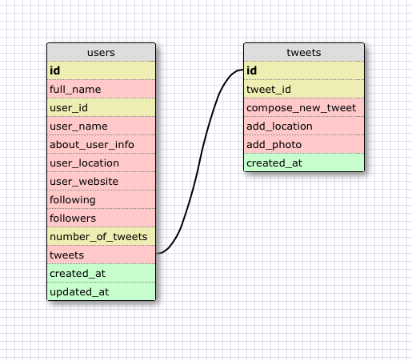

# U3.W7: Modeling a Real-World Database (SOLO CHALLENGE)

## Release 0: Users Fields

full_name, user_name, about_user_info, user_location, user_website, following, followers, number of tweets, tweets

## Release 1: Tweet Fields

compose_new_tweet, add_location, add_photo

## Release 2: Explain the relationship
The relationship between `users` and `tweets` is: 

the tweet belongs to only one user, but the user can have many tweets. So the relationship is One to Many.

## Release 3: Schema Design

## Release 4: SQL Statements

## all the tweets for a certain user id

SELECT tweets FROM users
WHERE user_id = 12345

## the tweets for a certain user id that were made after last Wednesday (whenever last Wednesday was for you)

SELECT tweets FROM users
WHERE user_name = "JessicaT" 
AND created_at between '04-16-2014' AND '04-23-2014'

## all the tweets associated with a given user's twitter handle

SELECT tweets FROM users JOIN tweets ON id.users = user_id
WHERE user_name = "JessicaT"

## the twitter handle associated with a given tweet id

SELECT user_name FROM users JOIN tweets ON id.users = user_id
WHERE tweet_id = 123

## Release 5: Reflection
I enjoyed working with the SELECT statements for this challenge. I was a little confused with the directions for which fields we needed to collect from Twitter, as I am not really a Twitter user, but as I went through each piece of the challenge, it became clear which pieces of information I needed. I had to research a little bit more about the JOIN method in SQL, but I feel as if the SQLZoo challenge really prepared me well for this SOLO challenge. 