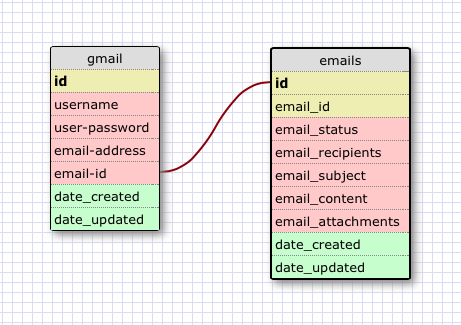

<!-- ## Show the terminal output here.  -->
## ACCOUNTS TABLE
sqlite> SELECT * FROM accounts;
id          username       user_password  email_address        email_id    date_created         date_updated       
----------  -------------  -------------  -------------------  ----------  -------------------  -------------------
1           JessicaTatham  cheese         jectatham@gmail.com  123         2014-04-29 00:00:00  2014-04-29 00:00:00
sqlite> 

## EMAILS TABLE
sqlite> SELECT * FROM emails;
id          email_id    email_status  email_recipients  email_subject  email_content                           email_attachments  date_created         date_updated       
----------  ----------  ------------  ----------------  -------------  --------------------------------------  -----------------  -------------------  -------------------
1           10          unread        mtatham@mac.com   Tutorial       You should watch this tutorial on SQL.  tutorial           2014-04-29 00:00:00  2014-04-29 00:00:00
2           1           read          mtatham@mac.com   Hi             How are you?                            none               2014-04-29 00:00:00  2014-04-29 00:00:00
3           2           read          mtatham@mac.com   Weekend        Im working this weekend                 work_schedule      2014-04-13 00:00:00  2014-04-29 00:00:00
4           3           unread        aneliquetatham@m  School         What time do you get out of school?     none               2014-04-01 00:00:00  2014-04-29 00:00:00
5           4           trash         xxx@yahoo.com     Hello          blah blah blah money                    none               2014-02-23 00:00:00  2014-04-29 00:00:00
6           5           read          sabrina.tatham@m  Tonight        Are you going to be home tonight?       none               2014-04-29 00:00:00  2014-04-29 00:00:00
7           6           unread        mtatham@mac.com   DBC            The DBC payment is due.                 DBC tuition form   2014-04-10 00:00:00  2014-04-29 00:00:00
8           7           junk          345@mac.com       SALE           Buy something                           none               2014-04-29 00:00:00  2014-04-29 00:00:00
9           8           unread        jt@mac.com        Sup?           How are you?                            none               2014-04-29 00:00:00  2014-04-29 00:00:00
10          123         unread        mtatham@mac.com   Joining        Lets join this email.                   none               2014-04-29 00:00:00  2014-04-29 00:00:00
sqlite> 

## JOINING TABLES
sqlite> SELECT email_address, email_recipients, email_subject FROM accounts, emails 
   ...> WHERE accounts.email_id = emails.email_id;
email_address        email_recipients  email_subject
-------------------  ----------------  -------------
jectatham@gmail.com  mtatham@mac.com   Joining      
sqlite> 